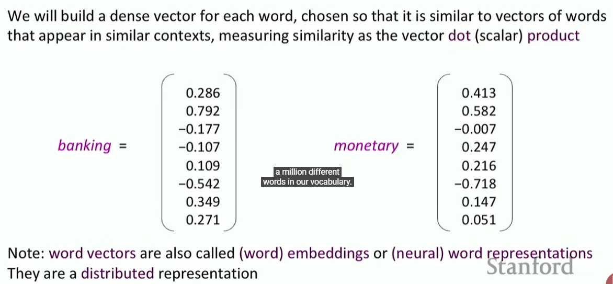
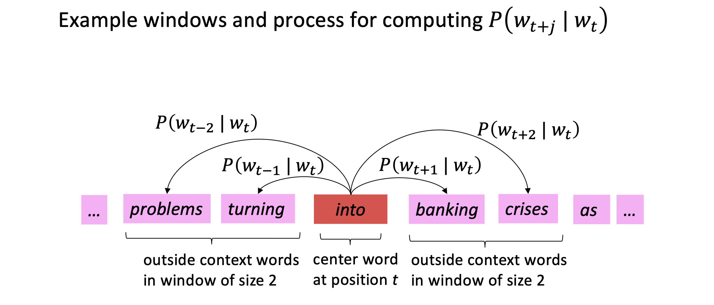

### Course

Review Python (Numpy) and PyTorch

Learning goals

* use deep learning on NLP
* understanding of human languages (linguistics)
* ability to build systems

Content

- 4 * 1.5 week assignment
- final project: BERT LLM
- participation

### Human Language

language gives us a scaffold to do much more detailed things and planning because we think in langjuage.

- language is pertty old but writing is actually recent
- languages are changing

Recent advancements in NLP

* neural machine translation
* free-text question answering, [paper](https://arxiv.org/pdf/2112.07381.pdf)
* GPT-2: starter of large language model
* ChatGPT, GPT-4, and more

### Meaning

**(1) denotational semantics**: the "meaning" of an expression is the specific object or set of objects in the world that it points to. So to understand a word, you must know what it refers to in reality.

+ meaning is the relationship between the signifier (symbol, e.g., the word "Tree") and the signified (idea or thing, like the mental concept of a tree)
+ *WordNet* is a lexical database for English that acts like a "super-thesaurus" for machines. It misses a lot of nuances.

(2) Word vectors: one-hot vectors

- We use *one-hot vectors* to represent words: model = [0,0,0,0,0,0,0,1,...] -> Vector dimension = number of words in vocabulary. There is no natural notion of similarity for this approach (motel and hotel should be smiliar!)

(3) Word vectors (embeddings)

- **Distributional semantics**: words that appear in similar contexts share similar meanings.
- **context** is the set of words that appear nearby (within a fixed-size window).
- We use many contexts of *w* to build up a representation of *w*

- A dense vector is a long list of numbers (usually 50, 100, or 300 dimensions) where every single slot is a non-zero number. Instead of a "1" representing the identity of the word, each dimension in a dense vector represents a "latent" (hidden) feature of meaning.
- A good vector is a vector which catches the word's meaning. If we visualize all words, we can find similar word are literially close to each other.

> Different contexts -> different similarties? Currently, we only have one vector for a string. You can understand this is the avg of all aespects of a word. Later, we will learn more.

### Main topic: Word2vec

Word2vec is the most famous algorithm for turning words into dense vectors.

Approaches:

- Skip-gram, using the *center* word to predict the *context* words.
- CBOW (Continuous Bag of Words), using the context words to predict the center word.

Skip-gram:

- We create a Vocabulary ($V$) of all unique word types. We then assign every word a "dense vector" of random numbers
- We go through each **position** *t* in the text, which has **a center word $c$** and **context (“outside”) words $o$**
- We take the dot product of the Center vector and the Outside vector: higher product, higher similarity. Then we use Softmax function to convert it to probability.
- Optimization/Learning: we nudge the number in $c$ and $o$ so that we can predict high probability for words appearing together.

> Side notes:
>
> - Token: An individual occurrence of a word in a text (the total count).
> - (Word) Type: A unique word in the vocabulary (the "dictionary" entry).
>   - "Cute is as cute does."
>     - Tokens: 5 (Total words: Cute, is, as, cute, does)
>     - Types: 4 (Unique words: Cute, is, as, does)

### Math Details

- Baisc ideas: slides P28, 29, 30, 31

**Mechanism**

When the model makes a bad prediction (e.g., it thinks "bank" and "river" are unrelated), the **Loss Function (**$J$**)** tells us how much we messed up. We use partial derivatives to answer two specific questions:

1. **$\frac{\partial J}{\partial v_c}$** : how to move the center word's position in the space so it aligns better with its current context.
2. **$\frac{\partial J}{\partial u_o}$** : how to adjust the outside word's representation so that it "recognizes" the center word **$c$** more easily next time.

**Results of partial deratives**

$$
\nabla_{v_c} \log P(o|c) = u_o - \sum_{x \in V} P(x|c) u_x
$$

This result is beautiful because it has a clear physical meaning:

1. **$u_o$ (Actual):** This is the vector of the word that *actually* appeared. The model wants to move **$v_c$** toward this.
2. **$\sum P(x|c) u_x$ (Expected):** This is the "average" of all vectors in the dictionary, weighted by how much the model *thinks* they should be there.

**Calculation details** 

see ./refereneces/[Jack's Notes] 1-Intro and Word Vectors/Appendix: gradients for loss function (2)
